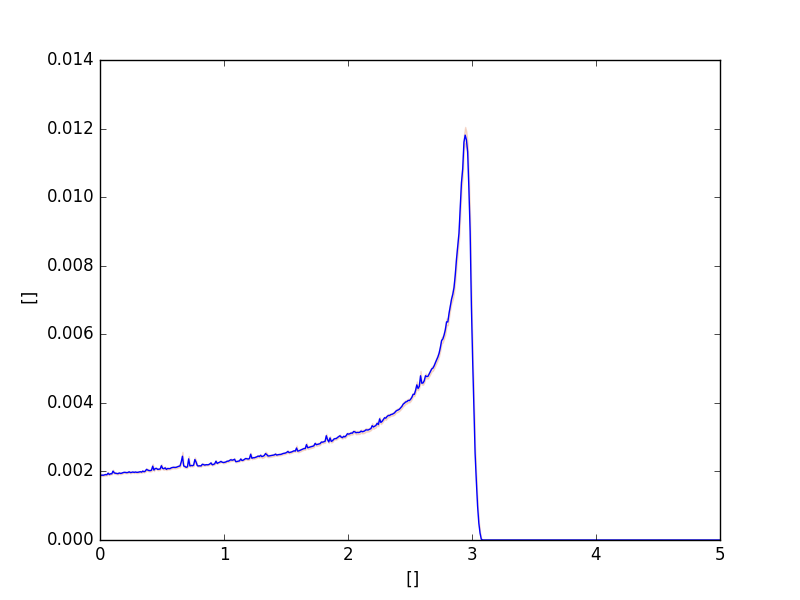

.. _getting_started:

===============
Getting Started
===============

.. rubric:: Brief overview of pymchelper and how to install it.

Introduction
============

Let us assume you are running particle transport simulation using Fluka MC code.
Two estimators: particle fluence and deposited energy are defined in the input file.
To get high statistics run is parallelised into 100 different jobs, each of them producing 2 binary files.
That gives 200 binary output files, typically following ``*_fort.*`` pattern. 

pymchelper comes with **convertmc** program which simplifies postprocessing of such binary data.

To convert all binary files into two text files (one for energy and one for particle fluence) type ::

    convertmc txt --many "*_fort.*" 

pymchelper will automatically figure out how many scorers were defined and which files to merge.
Two new files will be created: `21.txt` and `22.txt` which can further processed.
By default they will contain 5 columns: X,Y,Z coordinates, data and error column::

 0.0000000E+00  0.0000000E+00  0.5000000E-02  0.1881775795482099E-02  0.2157818940293169E-04
 0.0000000E+00  0.0000000E+00  0.1500000E-01  0.1893831696361303E-02  0.2251415707395123E-04
 0.0000000E+00  0.0000000E+00  0.2500000E-01  0.1887728041037917E-02  0.1936414681456153E-04
 0.0000000E+00  0.0000000E+00  0.3500000E-01  0.1897429465316236E-02  0.1944586725074595E-04

In case estimated value was scored on 1-dimensional grid, it can be easily plotted.
Same thing might be done if 2-D scoring grid was used - then a heatmap type plot can be produced.
In order to get such plots instead of text files, replace first argument with `image`::

    convertmc image --many "*_fort*" 

Two new PNG files will be created which can be directly opened, for example

If you are SHIELD-HIT12A user, same effect can be achieved by processing `*.bdo` binary files. 

These are just basic examples. To learn more about additional features, proceed to :doc:`User's Guide </user_guide>`. 
Among these features are:

* reading binary ``*.bdo`` files generated by SHIELD-HIT12A code
* reading binary ``*_fort*`` files generated by FLUKA
* writing PNG images (1 and 2D plots)
* calculating standard error when averaging many files
* writing tabulated text files
* writing gnuplot scripts

Quick Installation Guide
========================

First be sure to have Python framework installed, then type::

    pip install pymchelper

In case you don't have administrator rights, add ``--user`` flag to ``pip`` command.
In this situation converter will be probably installed in ``~/.local/bin`` directory.

License
=======

pymchelper is licensed under `MIT LICENCE`.
