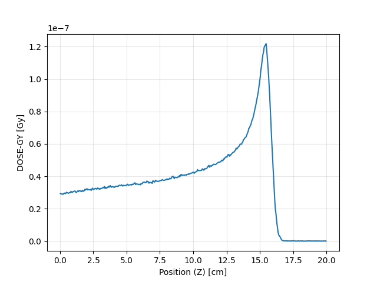
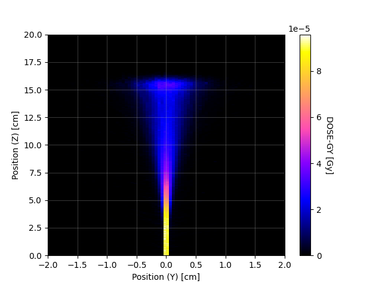
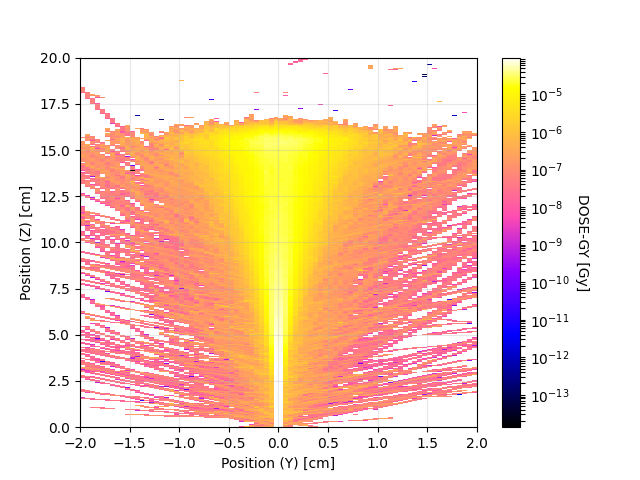
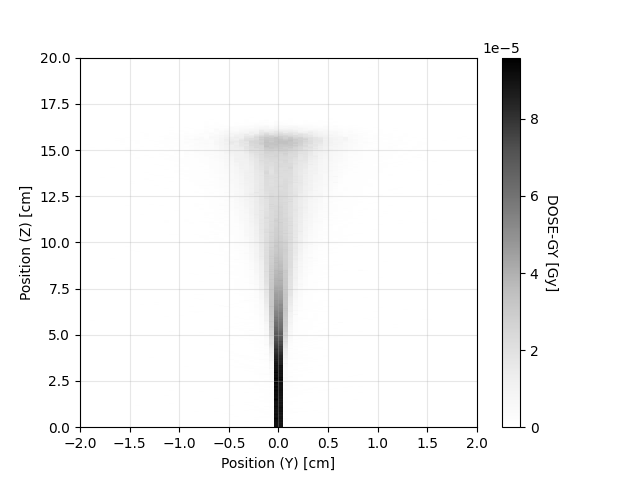

.. highlight:: bash

.. role:: bash(code)
   :language: bash

Plots and images
================

``image`` converter is very useful tool to quickly inspect simulation results. 
It accepts data with any 1-D and 2-D scoring grid and is producing images in PNG format with plots. 
Conversion is done using standard command::

    convertmc image --many "*.bdo"

After converting data with 1-D scoring grid, following plot can be generated:

Data containing 2-D scoring grid are visualised as heatmap with color denoting scored value.

Options
-------

Logarithmic scale
^^^^^^^^^^^^^^^^^

User can also set logscale on one or more axis in the plots using `--log` option.

An example plot with 2-D heatmap and logarithmic scale on Z (color) axis::

    convertmc image --many "*.bdo" --log z

Colormap
^^^^^^^^

When generating 2D heatmaps it is also possible to specify colormap. List of available colormaps is
available here: https://matplotlib.org/stable/tutorials/colors/colormaps.html. By default colormap called `gnuplot2` is used.
An example plot obtained with other colormap (`Greys`) can be obtained with following command::

    convertmc image --many "*.bdo" --colormap Greys

